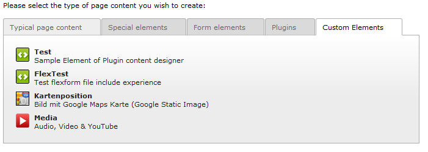

.. include:: ../Includes.txt
.. include:: Images.txt

.. _introduction:

Introduction
============

.. only:: html

	:ref:`what-it-does` | :ref:`screenshots` | :ref:`authors` |

.. _what-it-does:

What does it do?
----------------

Normally, everytime you need a new Content Element Type for “special Content”, you need to write a new Extension. With this extension you can create new Content Elements fast and easy, just with TypoScript or FlexForms. The new CE's will appear in the Content Element Wizard in a special Sheet and Ctype Dropdown.

Another features are same as above, but you can extend the Page Properties with new Options or extend any other Content Elements (CType's).

Works fine with TYPO3 7.x (without Templavoila). For older versions (with/without Templavoila, support TYPO3 6.x) take a look at older version or my Ext. typoscript_content or ts_select.

Feel free to give me a feedback or donate it, if you like it.

**Also you could contact me for support or new projects :-)**

But for support, please think about how much time i've spent to create this free extension. It would be nice if you think about a little gift or other donation for support.

.. _screenshots:

Screenshots
-----------

Here you see what the extension does:
^^^^^^^^^^^^^^^^^^^^^^^^^^^^^^^^^^^^^

    Custom elements in wizards wiev

|example1|
Custom Media element from the inside

.. _authors:

Authors
-------

This is extension is created by Hendrik Reimers (`http://www.kern23.de <http://www.kern23.de>`_)

|kern23|
